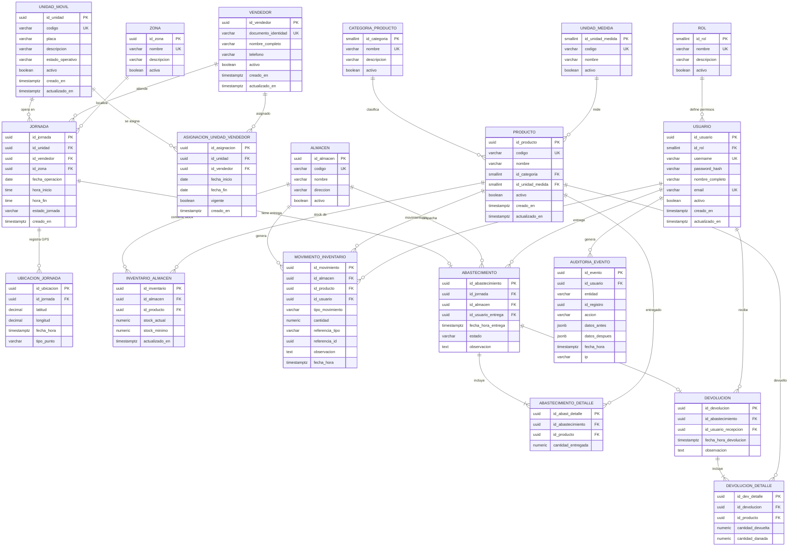

# Modelo de datos completo (lógico y físico)

Documento de planificación integral para el sistema de abastecimiento de FAST FOOD S.A.  
Incluye diagrama ER en Mermaid, modelo lógico normalizado y propuesta física para PostgreSQL.

---

## 1) Diagrama entidad-relación (Mermaid)

---

## 2) Modelo lógico (normalizado)

### Entidades maestras
- `ROL(id_rol, nombre, descripcion, activo)`
- `USUARIO(id_usuario, id_rol, username, password_hash, nombre_completo, email, activo, creado_en, actualizado_en)`
- `VENDEDOR(id_vendedor, documento_identidad, nombre_completo, telefono, activo, creado_en, actualizado_en)`
- `UNIDAD_MOVIL(id_unidad, codigo, placa, descripcion, estado_operativo, activo, creado_en, actualizado_en)`
- `ZONA(id_zona, nombre, descripcion, activa)`
- `CATEGORIA_PRODUCTO(id_categoria, nombre, descripcion, activo)`
- `UNIDAD_MEDIDA(id_unidad_medida, codigo, nombre, activo)`
- `PRODUCTO(id_producto, codigo, nombre, id_categoria, id_unidad_medida, activo, creado_en, actualizado_en)`
- `ALMACEN(id_almacen, codigo, nombre, direccion, activo)`

### Entidades transaccionales
- `ASIGNACION_UNIDAD_VENDEDOR(id_asignacion, id_unidad, id_vendedor, fecha_inicio, fecha_fin, vigente, creado_en)`
- `JORNADA(id_jornada, id_unidad, id_vendedor, id_zona, fecha_operacion, hora_inicio, hora_fin, estado_jornada, creado_en)`
- `UBICACION_JORNADA(id_ubicacion, id_jornada, latitud, longitud, fecha_hora, tipo_punto)`
- `INVENTARIO_ALMACEN(id_inventario, id_almacen, id_producto, stock_actual, stock_minimo, actualizado_en)`
- `MOVIMIENTO_INVENTARIO(id_movimiento, id_almacen, id_producto, id_usuario, tipo_movimiento, cantidad, referencia_tipo, referencia_id, observacion, fecha_hora)`
- `ABASTECIMIENTO(id_abastecimiento, id_jornada, id_almacen, id_usuario_entrega, fecha_hora_entrega, estado, observacion)`
- `ABASTECIMIENTO_DETALLE(id_abast_detalle, id_abastecimiento, id_producto, cantidad_entregada)`
- `DEVOLUCION(id_devolucion, id_abastecimiento, id_usuario_recepcion, fecha_hora_devolucion, observacion)`
- `DEVOLUCION_DETALLE(id_dev_detalle, id_devolucion, id_producto, cantidad_devuelta, cantidad_danada)`
- `AUDITORIA_EVENTO(id_evento, id_usuario, entidad, id_registro, accion, datos_antes, datos_despues, fecha_hora, ip)`

### Reglas de integridad clave
- `UNIQUE` en catálogos de negocio (`codigo`, `documento_identidad`, `username`, `email`).
- `UNIQUE(id_almacen, id_producto)` en `INVENTARIO_ALMACEN` para evitar duplicados.
- `UNIQUE(id_abastecimiento, id_producto)` y `UNIQUE(id_devolucion, id_producto)` en detalles.
- `CHECK` de cantidades `>= 0` en inventario, entrega y devolución.
- `CHECK` de coordenadas (`latitud` entre -90 y 90, `longitud` entre -180 y 180).

---

## 3) Normalización aplicada

### Primera forma normal (1FN)
- Todos los atributos son atómicos.
- No existen listas o grupos repetitivos en una sola columna.
- Los detalles de abastecimiento/devolución se separan en tablas hijas.

### Segunda forma normal (2FN)
- No hay dependencias parciales respecto a claves compuestas.
- En detalles se usa PK surrogate (`id_*_detalle`) y unicidad compuesta para la regla de negocio.

### Tercera forma normal (3FN)
- Se eliminan dependencias transitivas:
  - `PRODUCTO` referencia `CATEGORIA_PRODUCTO` y `UNIDAD_MEDIDA` en lugar de repetir textos.
  - `USUARIO` referencia `ROL`.
  - `JORNADA` referencia `UNIDAD_MOVIL`, `VENDEDOR`, `ZONA`.
- Las propiedades derivables (por ejemplo consumo) se obtienen por consulta y no se almacenan duplicadas.

### BCNF (aplicable en tablas críticas)
- Catálogos con claves candidatas (`codigo`, `username`, `email`, `documento_identidad`) cumplen BCNF.
- Tablas puente/control (`INVENTARIO_ALMACEN`, detalles) mantienen determinantes como claves.

---

## 4) Modelo físico (PostgreSQL, propuesta)

### Convenciones
- Esquema `public`.
- PK: `uuid` con `gen_random_uuid()` (o `uuid_generate_v4()`).
- Fechas en `timestamptz`.
- Cantidades en `numeric(12,2)`.
- Coordenadas en `numeric(10,7)`.
- Índices en FKs y columnas de búsqueda frecuente.

### Índices sugeridos
- `idx_jornada_fecha` en `JORNADA(fecha_operacion)`
- `idx_abastecimiento_fecha` en `ABASTECIMIENTO(fecha_hora_entrega)`
- `idx_movimiento_fecha` en `MOVIMIENTO_INVENTARIO(fecha_hora)`
- `idx_auditoria_fecha` en `AUDITORIA_EVENTO(fecha_hora)`
- `idx_ubicacion_jornada_fecha` en `UBICACION_JORNADA(id_jornada, fecha_hora)`

### Vistas de apoyo (reportes)
- `vw_consumo_por_jornada`: entregado - devuelto - dañado por producto/jornada.
- `vw_consumo_por_unidad`: agregación por unidad móvil y período.
- `vw_stock_actual`: stock por almacén y producto.

---

## 5) Evolución respecto al sprint actual

El sprint implementado hoy cubre parcialmente:
- `PRODUCTO`
- `VENDEDOR`
- `UNIDAD_MOVIL`

Para completar el modelo del caso, el siguiente paso técnico es implementar:
1. `JORNADA`, `ABASTECIMIENTO`, `ABASTECIMIENTO_DETALLE`
2. `DEVOLUCION`, `DEVOLUCION_DETALLE`
3. `INVENTARIO_ALMACEN`, `MOVIMIENTO_INVENTARIO`, `AUDITORIA_EVENTO`

