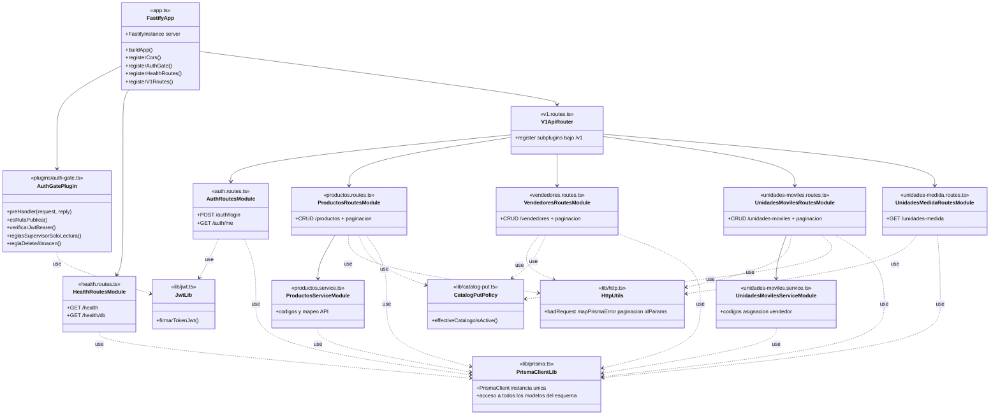
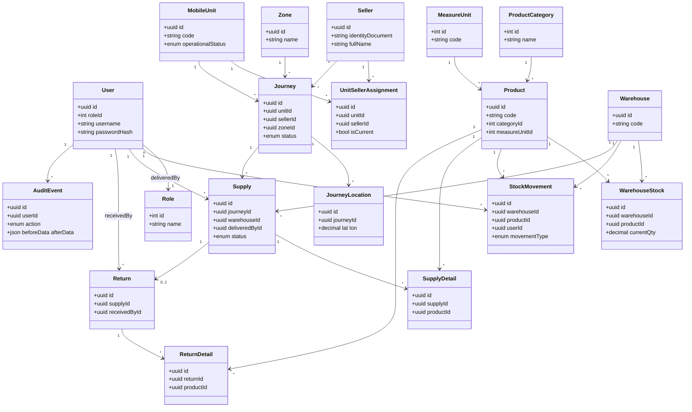

# Diagrama de clases de diseño — Backend (alcance completo del repositorio)

**Proyecto:** FAST FOOD S.A. — abastecimiento  

Este documento une **(A)** la capa de aplicación **tal como está implementada hoy** en código y **(B)** el **modelo de datos completo** definido en Prisma (`schema.prisma`), aunque varias entidades aún no tengan módulos REST (inventario, jornadas, abastecimiento, devoluciones, auditoría, etc.).

**Estilo:** Misma convención que el diagrama de defensa de referencia: módulos arriba, **PrismaClientLib** como núcleo de acceso a datos, dependencias `use` punteadas.

---

## A. Capa de aplicación (implementación actual)

*Igual que Sprint 1 en rutas y libs: no hay aún `inventario.routes.ts`, `abastecimiento.routes.ts`, etc.*

---

## B. Modelo de persistencia completo (Prisma)

*Refleja `apps/backend/prisma/schema.prisma`. Las futuras historias (inventario, abastecimiento, GPS, devolución, reportes, auditoría) consumirán estas entidades vía `PrismaClientLib`.*

---

## Relación entre vistas A y B

- Hoy, **solo** las entidades ligadas a **User, Role, Product, ProductCategory, MeasureUnit, Seller, MobileUnit, UnitSellerAssignment** reciben tráfico desde los módulos de rutas.
- **PrismaClientLib** es el único punto de acceso ORM; cuando se agreguen módulos REST de inventario u operación, aparecerán nuevas cajas tipo `InventarioRoutesModule` con `..> PrismaClientLib : use` y uso de **Warehouse**, **WarehouseStock**, **Journey**, etc.

---

### Leyenda

| Elemento | Significado |
|----------|-------------|
| Diagrama **A** | Código TypeScript actual (`apps/backend/src`). |
| Diagrama **B** | Contrato de datos completo en PostgreSQL vía Prisma. |
| `..> use` | Dependencia hacia utilidades o hacia el cliente ORM. |
