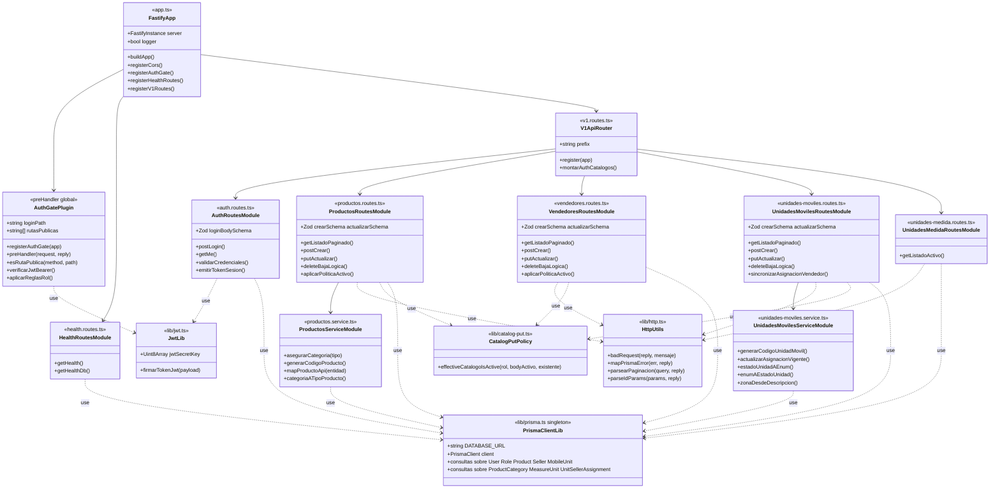
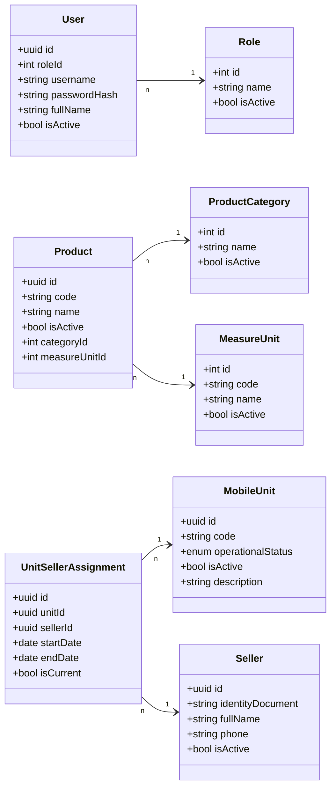

# Diagrama de clases de diseño — Backend (Sprint 1)

**Proyecto:** FAST FOOD S.A. — abastecimiento  
**Alcance:** HU1 (Productos), HU2 (Vendedores), HU3 (Unidades móviles), catálogo de unidades de medida, autenticación JWT y salud del servicio, según `PASOS_DESARROLLO.md`.

**Estilo:** Análogo al diagrama de defensa de referencia: **módulos de aplicación arriba**, **cliente de datos central abajo** (`PrismaClientLib`), dependencias **punteadas** etiquetadas `use`.

---

## 1. Capa de aplicación y utilidades → persistencia

---

## 2. Entidades de persistencia tocadas en Sprint 1

*(Tablas/modelos Prisma que intervienen en las historias del sprint.)*

---

### Leyenda

| Símbolo | Significado |
|--------|-------------|
| `..> ` *use* | Dependencia (import / llamada a utilidad o BD). |
| `-->` | Composición o registro en el arranque (Fastify). |
| Caja `<<*.routes.ts>>` | Plugin de rutas HTTP (controlador delgado). |
| `PrismaClientLib` | Equivalente funcional al **Db-lib.js** del proyecto de referencia: un solo acceso ORM centralizado. |

*Los nombres de archivo entre `<< >>` coinciden con `apps/backend/src/`.*
